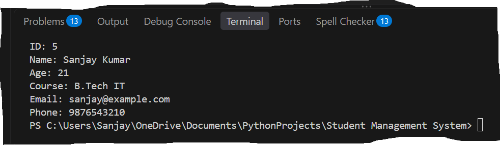

# Student Management System

A Python-based Student Management System using SQLite for storing and managing student records.

## Features
- Add new students
- View all students
- Search students by ID
- Update student details
- Delete student records
- SQLite database integration
- Input validation and error handling

## Technologies Used
- Python
- SQLite3
- SQL
- GitHub

## Project Files
- `main.py` — Main program and student management operations
- `database.py` — Database connection and table creation
- `students.db` — SQLite database file (created when the program runs)

## How to Run

1. Install Python 3.
2. Download or clone this repository.
3. Open the project folder in VS Code.
4. Run the following command:

```bash
python main.py
```

## Author
Sanjay Kushwaha

## Project Output


